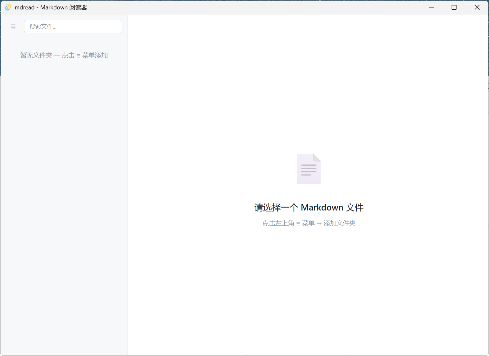

# mdread

> 轻量、本地优先、**只读**的 Markdown 桌面阅读器，基于 Tauri 2 构建。



mdread 专注于安全地阅读本地 Markdown，不提供编辑、账号、云同步、遥测上传或插件市场。文档内容、工作区和阅读偏好均保留在本机。

## 当前版本能力

## v1.2.2 发布说明

- 本次为稳定性补丁：修复独立文档授权释放、嵌套工作区权限重建、文档 A/B 快速切换、远程图片设置竞态和可取消的工作区搜索。
- 右侧目录在窄窗口会切换为可关闭的抽屉；文件树与目录均采用统一截断、滚动和键盘操作规则。
- 正式支持的本地文档扩展名仅为 `.md` 与 `.markdown`；`.mdx`、`.mkdn`、`.mdown` 会被明确拒绝。
- Windows v1.2.2 安装包**未签名**：Windows 可能显示安全提示，下载者应通过 Release 附带的 `SHA256SUMS.txt` 校验文件完整性。

### 阅读与导航

- GitHub Flavored Markdown：表格、任务列表、删除线、代码块和图片。
- highlight.js 代码高亮；每个代码块都提供“复制”按钮，不受文档标题数影响。
- 稳定的右侧大纲：同名标题会生成唯一锚点；标题少于 3 个时不强制显示大纲。
- 阅读进度、字体缩放（70%–180%）、5 套主题和 4 套字体样式；主题可跟随系统切换。
- `Ctrl/Cmd+P` 与菜单共用浏览器原生打印流程，打印样式会隐藏应用界面、处理代码块换页、压缩图片，并在外链后附带 URL。

### 工作区与会话

- 多工作区、按需加载文件树、目录刷新和可重试的目录读取失败。
- 搜索可找到未展开目录中的文件；输入 `content: 关键词` 可按需扫描 Markdown 正文。搜索不会改变原有文件夹折叠状态。
- 最近文件、收藏、导航历史、上次文档、侧边栏宽度、主题、缩放和远程图片授权均在本机恢复。
- 支持拖放 `.md` / `.markdown` 文件；最近文件与拖放文件会同步标题、历史记录与已展开的树选中状态。

### 安全与可靠性

- Rust 后端维护工作区注册表与单文件授权表。读取、目录扫描和监听只接受工作区 ID / 文档 ID / 相对路径，而不是任意绝对路径。
- 每一次路径解析都会 canonicalize，并拒绝路径穿越、工作区外符号链接与非 Markdown 扩展名。
- 仅保留一个活动文档监听器；保存事件经过 220 ms 去抖。快速切换文档通过 `requestId` 实现 latest-wins，旧请求不能覆盖新内容。
- 文档编码顺序：UTF-8 BOM → 严格 UTF-8 → GBK。GBK 回退或解码替换会在文档元信息中提示。
- 默认阻止远程图片；可在菜单中对当前会话显式启用。危险图片协议、`file:`、`javascript:` 和未知链接协议均被拒绝。
- `http` / `https` / `mailto` 链接使用系统默认应用打开（Tauri 官方 opener 插件）；最终 HTML 在主线程经过 DOMPurify 净化。
- 超过 5 MiB 的内容搜索会跳过文件；超过 25 MiB 的文档需要用户确认后才读取。

## 快捷键

| 快捷键 | 操作 |
| --- | --- |
| `Ctrl/Cmd+O` | 添加工作区 |
| `Ctrl/Cmd+B` | 显示/隐藏侧边栏 |
| `Ctrl/Cmd+Shift+O` | 显示/隐藏大纲 |
| `Ctrl/Cmd+P` | 打印 / 导出为 PDF |
| `Ctrl/Cmd+=` / `Ctrl/Cmd+-` | 放大 / 缩小字体 |
| `Ctrl/Cmd+0` | 重置字体缩放 |
| `Alt+←` / `Alt+→` | 后退 / 前进历史 |
| `Esc` | 清空搜索或关闭菜单 |

文件树与大纲的按钮支持 Tab、Enter、Space、方向键、Home 和 End 键导航；所有主要控件都有焦点环与可读标签。

## 从源码构建

### 前置条件

- Node.js 20（CI 使用此版本；Node.js 18+ 通常也可用）
- Rust stable 工具链，含 `rustfmt` 与 `clippy`
- Tauri 2 平台依赖
  - Windows：Microsoft C++ Build Tools；安装包可使用 WebView2 在线引导程序。
  - macOS：系统 WebKit。
  - Linux：WebKitGTK 4.1、libappindicator3、librsvg2、patchelf（CI 的安装命令见工作流）。

```bash
npm ci
npm run check             # 版本一致性 + TypeScript + Vite 生产构建
npm run test:coverage     # Vitest + jsdom 覆盖率门禁
npm run test:e2e          # Windows 桌面 WebdriverIO 冒烟 E2E（构建测试二进制）
npm run generate:sbom     # 生成 CycloneDX 1.5 SBOM
npm run generate:checksums # 为 release-assets 递归生成 SHA-256 清单

cd src-tauri
cargo fmt --check
cargo clippy -- -D warnings
cargo test
```

开发与打包：

```bash
npm run tauri dev
npm run tauri build
```

Windows 默认使用轻量的 WebView2 bootstrapper；完全离线运行时建议另外分发离线 WebView2 Runtime 安装方案，而不是将大体积 Runtime 固定捆绑进所有安装包。

## 质量门禁与发布

- `.github/workflows/quality.yml`：Windows、macOS、Linux 三平台执行前端构建、单元测试与覆盖率、npm/RustSec 依赖审计、Rust fmt / clippy / test；Windows 额外执行嵌入式桌面 E2E 冒烟测试。
- `.github/workflows/release.yml`：标签发布前重复执行质量门禁，由 Tauri Action 生成跨平台草稿安装包，并附加 CycloneDX SBOM 与覆盖全部归档 bundle 的 SHA-256 清单。
- `scripts/check-version.cjs`：校验 `package.json`、`src-tauri/tauri.conf.json` 和 `src-tauri/Cargo.toml` 的版本一致性。`scripts/generate-sbom.cjs` 与 `scripts/generate-checksums.cjs` 可在本地复现发布清单。

## 项目结构

```text
src/
  main.ts            应用控制与菜单、会话、收藏、导航与系统打开事件
  renderer.ts        安全 Markdown 渲染、请求竞态与文件监听生命周期
  filetree.ts        工作区树、目录缓存、后端搜索与键盘导航
  markdown-worker.ts Worker 内 Markdown 解析与高亮
  system-open.ts     启动参数、single-instance 与系统文件打开
  outline.ts         目录、代码复制、阅读进度
  storage.ts         版本化本地状态与迁移
  export-service.ts  单一打印/导出入口
src-tauri/src/lib.rs 工作区授权、路径校验、读取、编码、搜索、监听
```

## 已知边界

- 本版本不包含编辑、云同步、账户、协作、遥测和持久化全文索引。
- `content:` 搜索是可丢弃的按需扫描，而非搜索数据库；扫描只覆盖 Markdown 并跳过隐藏目录、`node_modules` 和超大文件。
- 已提供 `.md` / `.markdown` 文件关联、启动参数处理、single-instance 文件转交、Worker 解析和 Windows 桌面 E2E 冒烟覆盖。
- 代码签名、macOS 公证、正式自动更新服务与经过洁净系统验证的离线 WebView2 Runtime 分发需要发布证书、密钥、更新托管服务和对应系统环境；在这些外部条件具备前不会伪装为已启用，详见 [实施路线](docs/IMPLEMENTATION-ROADMAP.md)。

## 许可证

[MIT](LICENSE)
